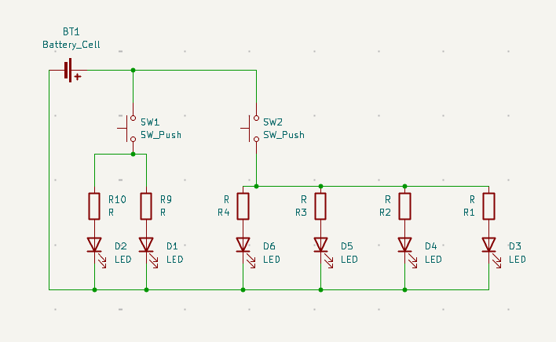
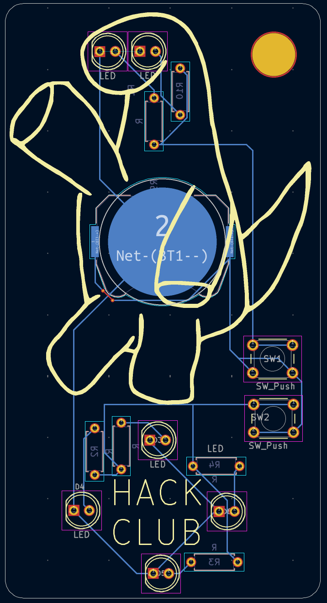

# Orpheus-Solder-Keychain

## Description:
This is a keychain of Orpheus. It is a rectangular PCB with rounded edges(radius 3). Toward the top, there is a silk screen of a waving Orpheus. The eyes are 2 LEDS. These LEDS are connected to one of two buttons on the side of Orpheus. Below Orpheus, there is the text "Hack Club" with four LEDS surrounding it. These LEDS are connected to the second button. All the wiring except one small one is done on the back where the battery is.

## Bill of Materials
1. 1 Battery Holder
2. 2 Buttons
3. 6 LED's
4. 6 220 Resistors

## Screenshots!

")
")

## Slack Username
@Maxine
